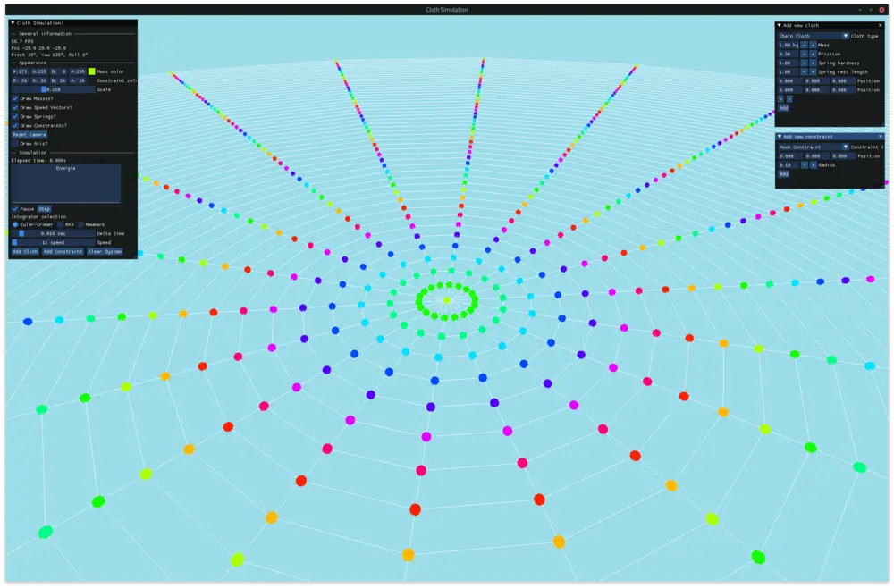
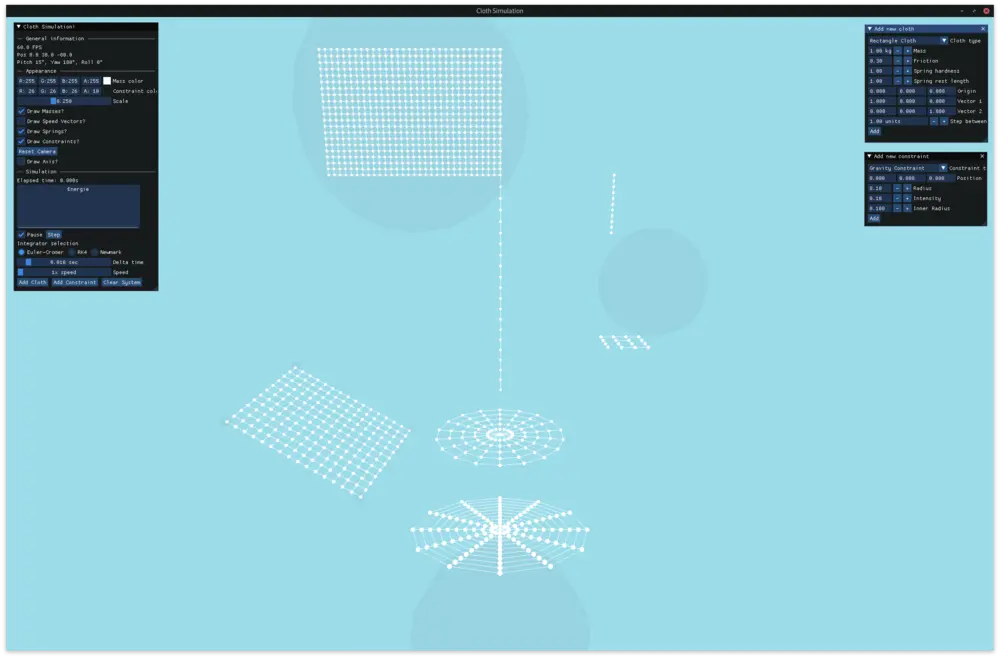
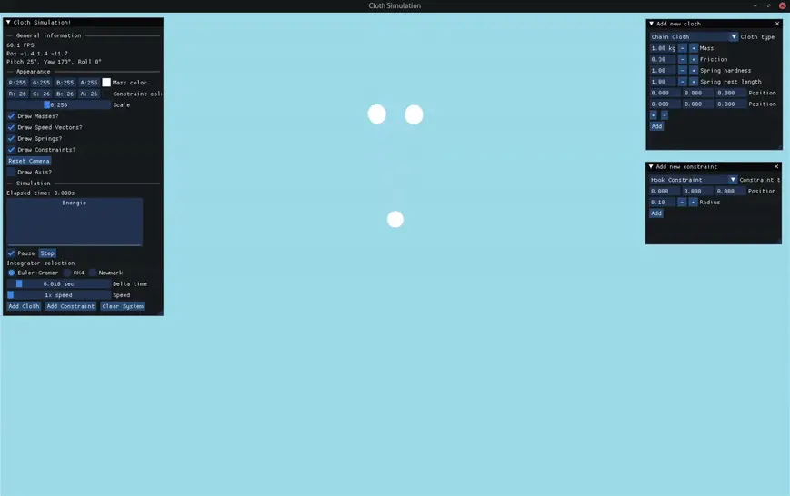

# Simulation de tissus

Projet programmation OOP - PH BA2

# Finalisation - TODO

[ ] Completer journal - M

[x] Completer conception - M & T

[x] Verifier réponses - M

[x] Documenter code

- [x] Partie physique - M 
- [x] Partie graphique - T

[x] Corriger tests - T

[ ] Rajouter tests nouveaux intégrateurs - M

[x] Rajouter tests tissus complexes - T

[x] Nettoyers includes - T

[x] Nettoyer TODOs - M & T

[ ] Nettoyer shitposts extremes - M & T

À LA FIN:

[ ] Passer un coup de formattage automatique

[x] Completer README

- [x] Questions
- [x] Instructions d'utilisation
- [x] Structure du projet
- [x] Screenshots

[ ] NOMS.txt

## Projet

Ce projet simule des tissus en les modélisant par des ensembles de masses et ressorts.

## Fonctionalités

- Partie Phyisque
  - Masses qu'on peut relier par des ressorts
  - Tissus simples à composer soi-même
  - Tissus complexes: chaine, rectangle, disque et composé
  - Système contenant des tissus et contraintes, capable de calculer son énergie
  - Différents intégrateurs numériques: Euler-Cromer, Runge-Kutta, Newmark
  - Contraintes: crochets, impulsions, impulsions sinusoïdales, attraction / répulsion
- Partie Graphique (GLFW + glew)
  - Dessin de plusieurs primitifs géométriques (lignes, cubes et sphères)
  - Coloration des ressorts en fonction de leur extension et compression
  - Dessin des vecteurs vitesse des masses
  - Dessin des sphères d'influences des contraintes
  - Transparence
  - Mouvement independant de la vitesse de rafraichissement
  - Caméra avec contrôles configurables, dans le style des contrôles Minecraft
  - Vsync (ne fonctionne pas sur les VMs)
- Application (ImGui)
  - Affichage des FPS
  - Controle du rendu graphique
    - Couleur des objets
    - Taille des masses
    - Controle de ce qui est dessiné
  - Controle de la simulation physique
    - Affichage de l'énergie du système
    - Mise en pause / avancement d'un pas
    - Selection de l'intégrateur `EulerCromer`, `RK4`, `Newmark`
    - Selection du pas de temps et vitesse de la simulation
    - Ajout dynamique de tissus et de contraintes
- Developpement
  - Option pour compiler en mode debug `make DEBUG=1`
  - Option pour changer les touches en fonction de la disposition du clavier `make LAYOUT=AZERTY`, `make LAYOUT=QWERTY`, autres cas avec les touches de direction
  - `TextRenderer` pour afficher la simulation dans un flot
  - `constants.h` pour les constantes physiques: g, pas de temps et epsilon
  - `settings.h` pour les paramètres de la fenêtre et les contrôles

Voir `GRAPHISME.md` pour plus d'informations sur nos choix de librairies.

## Temps

Nous estimons avoir passé environ 6-8h par personne sur le projet.

## Dépendences

- Inclus: [GLFW](https://github.com/glfw/glfw) (license ZLIB) pour la fenêtre OpenGL
- Inclus: [glm](https://github.com/g-truc/glm) (license MIT) pour les calculs matriciels
- Inclus: [Dear ImGui](https://github.com/ocornut/imgui) (license MIT) pour une interface de simulation agréable et configurable
- Inclus: [doxygen-awesome-css](https://github.com/jothepro/doxygen-awesome-css) (license MIT) pour une belle documentation
- Optionel, externe: [doxygen](https://github.com/doxygen/doxygen) pour générer la documentation

Puisque GLFW n'est pas installé sur les VMs, nous avons inclu une version précompilée de la librairie dans notre projet: `libs/GLFW/libglfw.a`.

## Compilation

Tout compiler

```bash
make all
```

Compiler et executer la partie graphique

```bash
make run
```

Compiler les tests

```bash
make tests
```

Compiler les exercices

```bash
make exercices
```

Pour executer les tests manuellement, faire, depuis la racine du projet, `./bin/test/<nom du test>`. Pour les exercices, `./bin/exercices/exerciceP<numero>`. Pour le programme principal, `./bin/clothSimulation`.

## Documentation

Pour générer la documentation, executer

```bash
make docs
make open_docs   # pour ouvrir la documentation dans le navigateur
```

Voir `docs/` pour la documentation en format texte simple

## Structure

- `docs/`: documentation du projet, `JOURNAL.md`, `REPONSES.md`, `CONCEPTION.md` et images
  - `doxygen-awesome-css/`: fichiers css pour rendre la documentation belle
- `exercices/`: code source pour les exercices P9, P10 et P11
- `libs/`: librairies externes utilisées `GLFW`, `glm` et `imgui`
- `output/`: fichiers de sortie pour les tests et `plotTestResults.ipynb` pour visualiser les résultats. Ne fonctionne pas entièrement sur les VMs, mais devrait contenir des images des résultats des tests
- `src/`
  - `app/`: code source pour la partie graphique
  - `common/`: code source pour la partie physique
  - `shaders/`: code source pour les shaders OpenGL
- `tests/`: code source pour les différents tests, organisé par type de test
- `Doxyfile`: configuration pour la documentation
- `Makefile`: configuration pour la compilation

## Screenshots






